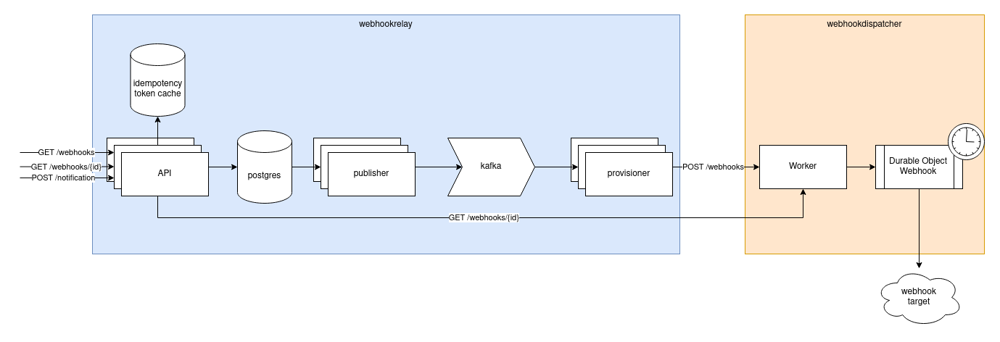

# WebhookRelay

WebhookRelay is an API that accepts and validates webhook requests, then provisions them to WebhookDispatcher for reliable dispatching.

### Components
- API, a REST API server used to create and get webhooks.
- publisher, an outbox service that publishes new webhooks to a kafka topic for provisioner
- provisioner, a kafka consumer that sends webhook details to the WebhookDispatcher

### TODO
- [ ] create service mocks
- [ ] create repository sql mocks
- [ ] create gRPC definition and server